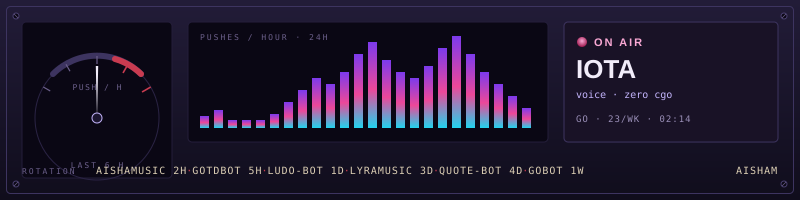
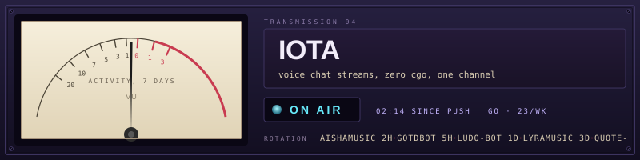
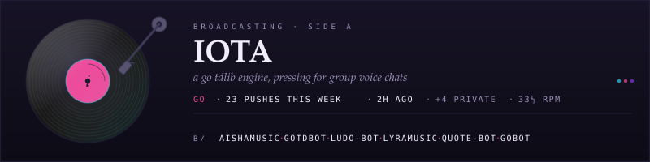
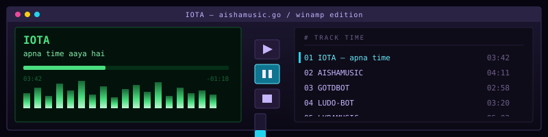
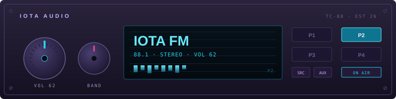

 

Telegram products and public tools: voice-chat music, arcade and economy, a pure Go TDLib client, and a small AI lab.

| Lane | What ships |
|------|------------|
| Music | Voice-chat queues, clones, playlists, Android player |
| Games | Economy, arcade, AI chat, group tools |
| Clients | Pure Go TDLib, quote rendering, robotics and IoT |
| Lab | Codex, ChatGPT Web, local voice |

## Public work

<table>
<tr>
<td width="50%" valign="top">

**Clients**

- [gotdbot](https://github.com/Iotatg/gotdbot) — TDLib in pure Go, zero CGO
- [quote-bot](https://github.com/Iotatg/quote-bot) — Telegram quote renderer
- [gobot](https://github.com/Iotatg/gobot) — robotics, drones, IoT

**Music**

- [lyraMusic](https://github.com/Iotatg/lyraMusic) — Material You Android player
- [persona-voice](https://github.com/Iotatg/persona-voice) — local near-realtime voices

</td>
<td width="50%" valign="top">

**Lab**

- [Astra-Ares](https://github.com/Iotatg/Astra-Ares) — adaptive Codex reasoning
- [codex-chatgpt-web](https://github.com/Iotatg/codex-chatgpt-web) — ChatGPT Web as a Codex model
- [watch-with-codex](https://github.com/Iotatg/watch-with-codex) — WebMCP watch-along
- [CodexMonitor](https://github.com/Iotatg/CodexMonitor) — Codex situation monitor

</td>
</tr>
</table>

Private line, source not public: **Iota** games and economy, **IotaXMusic / AishaMusic** voice-chat streaming.

## Studio

 

 

 

More panels

 

 

## Stack

 

 

 

