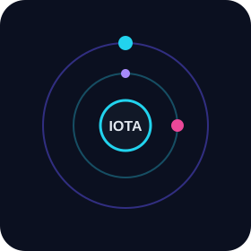

 

## Overview

Iota builds Telegram products and developer tools around music, games, AI, and native clients.

| Lane | What it is |
|------|------------|
| Music | Voice-chat streaming, queues, clones, and an Android player |
| Games | Economy, arcade, and social bots for Telegram groups |
| Clients | Pure Go TDLib, quote rendering, robotics/IoT |
| Lab | Codex, ChatGPT, and voice experiments |

## Public projects

<table>
<tr>
<td width="88" align="center"></td>
<td>

**[gotdbot](https://github.com/Iotatg/gotdbot)**  
Pure Go wrapper for Telegram TDLib. Generated, type-safe API. Zero CGO, powered by purego.

**[lyraMusic](https://github.com/Iotatg/lyraMusic)**  
Material You Android music app based on OpenTune.

**[persona-voice](https://github.com/Iotatg/persona-voice)**  
Custom output voices for ChatGPT, Codex, and Grok. Local and near real time.

</td>
</tr>
<tr>
<td width="88" align="center"></td>
<td>

**[Astra-Ares](https://github.com/Iotatg/Astra-Ares)**  
Adaptive reasoning effort for GPT-6 during Codex tasks, aimed at lower token use.

**[codex-chatgpt-web](https://github.com/Iotatg/codex-chatgpt-web)**  
Use ChatGPT Web, including Pro, as a native Codex model with context, tools, streaming, and images.

**[watch-with-codex](https://github.com/Iotatg/watch-with-codex)**  
Event-driven WebMCP watch-along for Codex and ChatGPT.

</td>
</tr>
<tr>
<td width="88" align="center"></td>
<td>

**[quote-bot](https://github.com/Iotatg/quote-bot)**  
Telegram quote bot.

**[CodexMonitor](https://github.com/Iotatg/CodexMonitor)**  
A small app to watch the Codex situation.

**[gobot](https://github.com/Iotatg/gobot)**  
Go framework for robotics, drones, and IoT.

</td>
</tr>
</table>

## Telegram

Private product line, not mirrored as public source:

- **Iota** — economy, games, AI chat, and group moderation
- **IotaXMusic / AishaMusic** — voice-chat music, playlists, clones, and admin tools

## Stack

 

 

