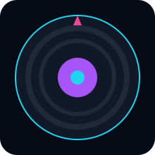
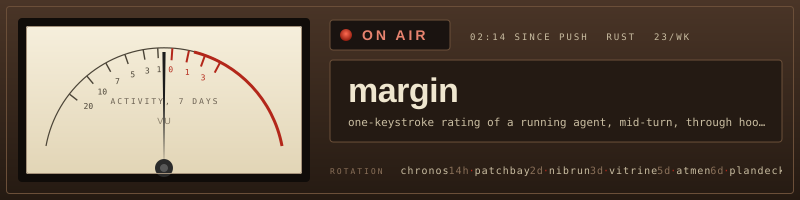
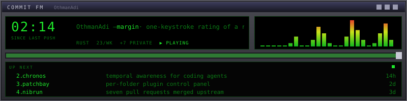
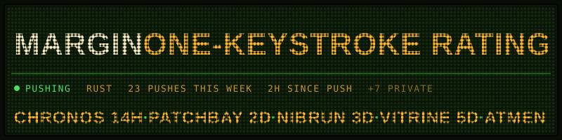
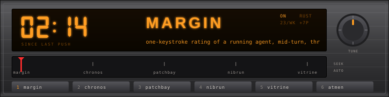
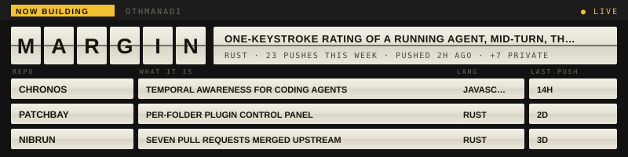

 

## Overview

Iota ships Telegram products and public developer tools around streaming, games, AI, and native clients.

| Lane | What ships |
|------|------------|
| Music | Voice-chat queues, clones, playlists, Android player |
| Games | Economy, arcade, AI chat, group tools |
| Clients | Pure Go TDLib, quote rendering, robotics/IoT |
| Lab | Codex, ChatGPT Web, voice output |

## Public projects

<table>
<tr>
<td valign="top" width="50%">

**Clients**
- [gotdbot](https://github.com/Iotatg/gotdbot) — TDLib in pure Go, zero CGO
- [quote-bot](https://github.com/Iotatg/quote-bot) — Telegram quote renderer
- [gobot](https://github.com/Iotatg/gobot) — robotics, drones, IoT

**Music**
- [lyraMusic](https://github.com/Iotatg/lyraMusic) — Material You Android player
- [persona-voice](https://github.com/Iotatg/persona-voice) — local near-realtime voices

</td>
<td valign="top" width="50%">

**Lab**
- [Astra-Ares](https://github.com/Iotatg/Astra-Ares) — adaptive Codex reasoning
- [codex-chatgpt-web](https://github.com/Iotatg/codex-chatgpt-web) — ChatGPT Web as a Codex model
- [watch-with-codex](https://github.com/Iotatg/watch-with-codex) — WebMCP watch-along
- [CodexMonitor](https://github.com/Iotatg/CodexMonitor) — Codex situation monitor

</td>
</tr>
</table>

Private product line (not public source): **Iota** games/economy and **IotaXMusic / AishaMusic** voice-chat streaming.

**Animated SVGs** — vinyl · vumeter · winamp · terminal · dotmatrix · carradio · splitflap · commit-fm

 

 

 

 

 

 

